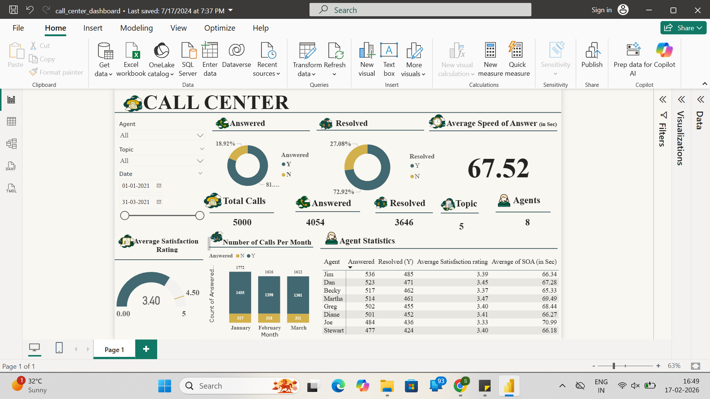
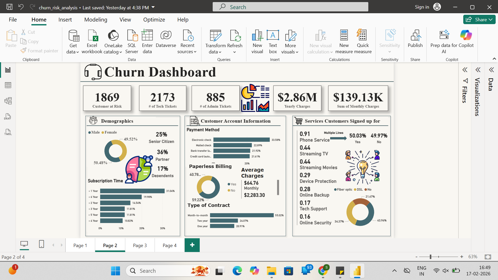
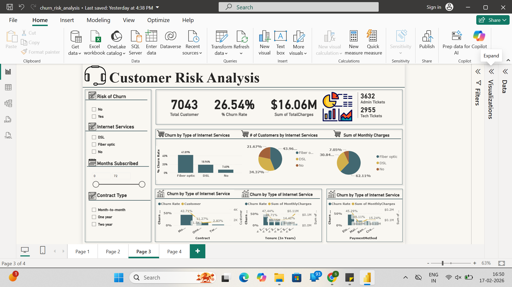
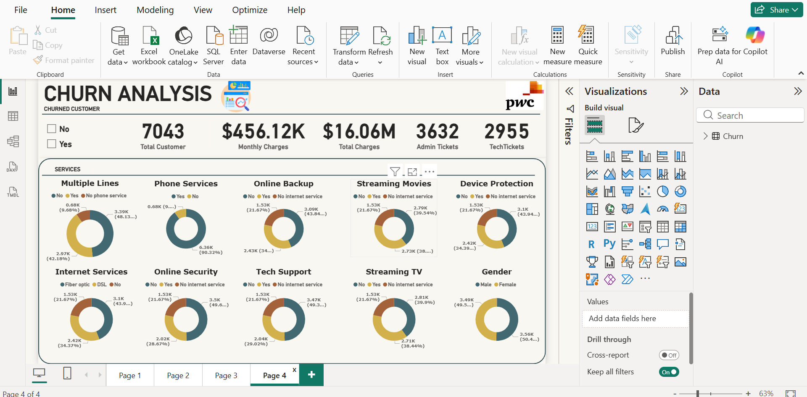

# 📞 Call Center Performance Dashboard – Power BI

## 📌 Project Overview
This project analyzes call center performance using Power BI dashboards to track operational and customer service KPIs.

---

## 📊 KPIs Analyzed
- Total calls received
- Calls answered vs abandoned
- Average speed of answer
- Customer satisfaction score
- Agent performance

---

## 🧰 Tools Used
- Power BI
- Excel
- DAX (Basic Measures)

---

## 📈 Business Value
This dashboard helps management:
- Monitor call center efficiency
- Identify performance gaps
- Improve customer satisfaction

---

## 🖼️ Dashboard Preview

